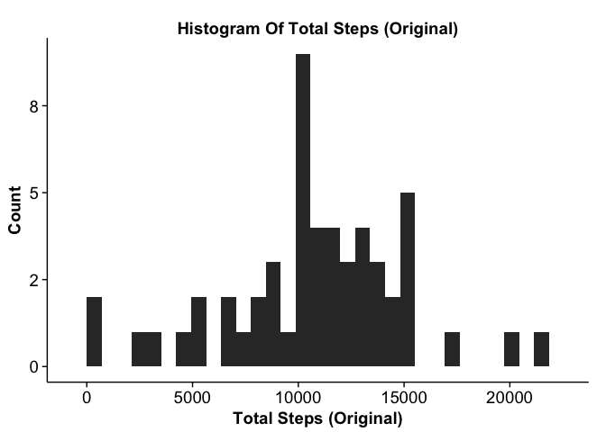
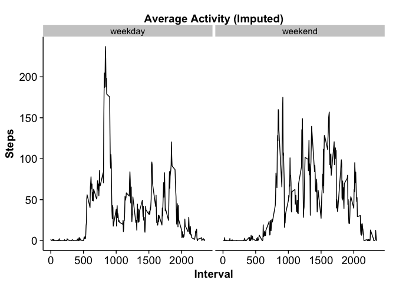

# Reproducible Research: Peer Assessment 1

## Loading and preprocessing the data

We load the libraries required for our analysis and then the activity data itself, assumed to be in the current working directory. For our purposes, the data requires little initial processing, aside from converting the `date` variable from type `string` to type `Date`. 


```r
# Set global options for displaying numbers
options(scipen=1, digits = 0)
# Load necessary libraries
suppressMessages(library(dplyr))
library(lubridate)
library (ggplot2)
# Read the data, assumed to be in the same directory
activity <- read.csv("activity.csv", stringsAsFactors = FALSE) %>% 
        # Convert date field
        mutate(date = as.Date(date)) 
```

## What is mean total number of steps taken per day?

To calculate the mean total number of steps per day (ignoring missing values), we filter incomplete records, calculate the total number of steps per day, and take the mean.


```r
# Find the total number of steps per day
totalSteps <- activity %>% group_by(date) %>% 
        summarise(steps=sum(steps, na.rm=TRUE))
# Calculate the mean
meanSteps <- round(mean(totalSteps$steps))
# Calculate the median
medianSteps <- round(median(totalSteps$steps))
# Make a histogram
p <- ggplot(data = totalSteps, aes(x = steps)) + geom_histogram() +
        ggtitle("Histogram of Total Steps (Original)") +
        xlab("Total Steps (Original)") + ylab("Count")
suppressMessages(print(p))
```

 

The histogram shows two main peaks to the data, at 0 steps (presumably during nighttime hours) and another centered at 10000. The mean number of steps taken per day is 9354 and the median number of steps is 10395, consistent with the histogram.

## What is the average daily activity pattern?

To calculate the average daily activity pattern (again, ignoring missing data), we take the mean for each interval across all days.


```r
# Calculate the mean for each interval
dailyActivity <- activity %>% group_by(interval) %>% 
        summarise(steps=mean(steps, na.rm=TRUE))
# Calculate the interval with the greatest number of steps, on average
maxInterval <- filter(dailyActivity, steps==max(steps))$interval
# Plot
p <- ggplot(data=dailyActivity, aes(interval, steps)) + geom_line() + 
       labs(title="Average Daily Activity", x="Interval", y="Steps")
print(p)
```

 

The most activity, averaged across all days, is observed for the interval 835 (presumably while the subject is commuting to work, either on foot or by public transportation). As expected, the nighttime hours are relatively devoid of activity.

## Imputing missing values

Our strategy for imputing missing values is to replace them with the mean for that interval on that day of the week. (For example, a missing value at interval 835 on a Monday becomes the mean for all steps taken at that interval averaged over all Mondays in the dataset.) This strategy is predicated on the assumption that the subject, like most people, follows relatively predictable daily patterns on a weekly cycle.


```r
# Calculate total number of missing cases
missing <- sum(!complete.cases(activity))
# Find missing values by taking the mean for that interval on that day of the week
imputedActivity <- activity %>% mutate(day=wday(date)) %>%
        # Group by day of the week and time interval and find the mean
        group_by(day, interval) %>% mutate(mean=mean(steps, na.rm=TRUE)) %>%
        # Now fill in missing values
        mutate(steps=ifelse(is.na(steps), round(mean), as.numeric(steps))) %>%
        # And finally, ungroup
        ungroup
# Calculate total steps per day
totalImputedSteps <- imputedActivity %>% group_by(date) %>%   
        summarise(steps=sum(steps))
# Calculate mean and median
imputedMeanSteps <- round(mean(totalImputedSteps$steps))
imputedMedianSteps <- round(median(totalImputedSteps$steps))
# Now plot and compare with original dataset
p <- ggplot(data=totalImputedSteps, aes(x=steps)) + geom_histogram() +
        ggtitle("Histogram of Total Steps (Imputed)") + 
        xlab("Total Steps (Imputed)") + ylab("Count")
suppressMessages(print(p))
```

 

Using this strategy, we have filled in all 2304 missing values and determined a new mean of 10821 steps and median 11015. This is slightly higher than our previous mean and median, 9354 and 10395 respectively. Our histogram also no longer shows such a prominent spike at 0.

## Are there differences in activity patterns between weekdays and weekends?

To determine differences in activity patterns between weekdays and weekends, we follow a similar strategy to determining daily patterns above, but faceted over day type (`weekday` or `weekend`).


```r
# Compute activity by weekday/weekend
imputedActivityByDayType <- imputedActivity %>% ungroup %>% 
        # Factor day variable (7 and 1 correspond to Saturday and Sunday respectively)
        mutate(day.type=factor(ifelse(day %in% c(7,1), "weekend", "weekday"))) %>%
        # Summarize average steps for each interval for both weekday and weekend
        group_by(day.type, interval) %>% summarize(steps=mean(steps))
# Plot
p <- ggplot(data=imputedActivityByDayType, aes(interval, steps)) + geom_line() + 
        facet_grid(.~day.type) + ggtitle("Average Activity (Imputed)") + 
        xlab("Interval") + ylab("Steps")
print(p)
```

 

As expected, we see a clear difference between weekdays and weekends. The subject's morning spike occurs later on weekend mornings and is less prominent, appears to be more active during the day on weekends as well as later into the evenings.
